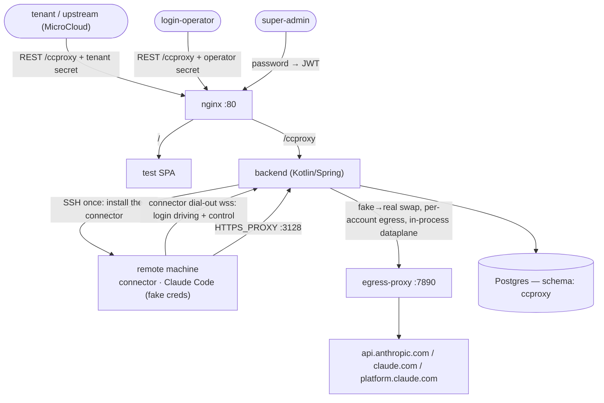

# CCProxy

CCProxy lets a remote machine run an ordinary, interactive **Claude Code** on a normal Anthropic
plan while the **real OAuth credentials never live on that machine**. A man-in-the-middle proxy (the
backend's in-process **dataplane**) sits between the machine's Claude Code and Anthropic and swaps a
per-machine **fake** credential for the machine's own **real** credential on the wire. The machine
can talk to Claude normally, but it never holds a token it could exfiltrate, and every machine is
metered independently.

> **The hard rule:** one machine = one independent Claude Code login, exactly like a person using
> Claude Code on their own computer. Real tokens are per-machine and are never shared across
> machines. Claude Code always runs in normal interactive mode — never `claude -p` / `--console`
> as the *login* path (those can draw on different quota); `claude -p` is used only to smoke-test a
> machine after it is READY.

This repository is a working proof of concept. It has been validated end to end: a plain Debian
container was provisioned, a human completed the OAuth step in a browser, the engine swapped the
tokens, and `claude` on the machine returned a real model response through the proxy.

---

## Table of contents

- [Concept](#concept)
- [Roles](#roles)
- [End-to-end lifecycle](#end-to-end-lifecycle)
- [Architecture](#architecture)
- [Components](#components)
- [Deployment](#deployment)
- [A full walkthrough with curl](#a-full-walkthrough-with-curl)
- [What a machine must provide](#what-a-machine-must-provide)
- [Operational notes & gotchas](#operational-notes--gotchas)
- [Build & CI](#build--ci)
- [Security model](#security-model)
- [Repository layout](#repository-layout)
- [Provenance](#provenance)

---

## Concept

Claude Code authenticates with an OAuth flow that yields per-user tokens. If you hand those tokens
to a fleet of machines you lose per-machine metering and any machine can walk off with the
credential. CCProxy keeps the credential off the machine:

1. Each machine is pointed at the backend's dataplane via `HTTPS_PROXY` and trusts a CCProxy-owned CA.
2. When a machine logs in, the dataplane intercepts the OAuth **code exchange**: Claude Code on the
   machine only ever sees a **fake** authorization code and **fake** tokens minted by the dataplane.
3. The dataplane holds the mapping fake ⟷ real and rewrites it on every request the machine makes to
   Anthropic, so from Anthropic's side the traffic is a normal, authenticated session, and from the
   machine's side the real token never appears.
4. All of a machine's traffic (and the browser login) egresses through one **account egress proxy**
   so the login and the subsequent API calls share a single outbound IP.

---

## Roles

| Role | Auth | Responsibilities |
|---|---|---|
| **super-admin** | password → session JWT | manages tenants, login-operators, and the Anthropic **account pool**; sees every machine and all usage. The account pool is invisible to everyone else. |
| **tenant** (e.g. MicroCloud) | opaque bearer secret | registers its own **machines**, triggers their logins, and reads its own usage. Never sees the account pool or other tenants. |
| **login-operator** | opaque bearer secret | the human who performs the manual OAuth step: works the **login-request** queue, opens the authorize URL in a browser, and submits the returned code. |

Secrets are opaque bearer tokens minted by the super-admin (`POST /tenant/{id}/secret`,
`POST /login-operator/{id}/secret`) and are validated by a filter (`SecretAuthFilter`) that maps a
secret to its principal. The super-admin authenticates with a password (`POST /superadmin/login`)
and receives a JWT.

---

## End-to-end lifecycle

```
super-admin: create account(s) in the pool ── each carries an egress proxy URL
super-admin: create a tenant + mint a tenant secret
super-admin: create a login-operator + mint an operator secret

tenant:      POST /machine            ── binds the machine to a free account, status=CREATED
             (async) provision        ── SSH host: SSH in ONCE to install the connector + dial in
                                          (curl install.sh | sh && ccproxy-connector connect); a
                                          hostless machine skips this — the operator runs it by hand.
                                          Online → status=AWAITING_LOGIN
tenant:      POST /machine/{id}/login ── opens a login-request, status=LOGGING_IN
             (async) prepare          ── over the connector link: set the login CA + HTTPS_PROXY on
                                          the session, run Claude Code in tmux (claude.js applet),
                                          scrape the OAuth authorize URL → login-request AWAITING_CODE

operator:    GET  /login-request      ── sees the pending request + the authorize URL
             (browser) open the URL, authenticate as the account identity, copy the "code#state"
operator:    POST /login-request/{id}/code
             (async) apply            ── prime the engine (real code → fake code), paste the fake
                                          code into Claude Code; the engine intercepts the token
                                          exchange, gets REAL tokens from Anthropic, hands FAKE
                                          tokens to the machine → machine status=READY

machine:     runs Claude Code normally; the engine rewrites fake→real on every Anthropic request.
             usage is reported back to the backend and attributed to the machine/tenant.
```

Machine status flow: `CREATED → PROVISIONING → AWAITING_LOGIN → LOGGING_IN → READY` (or `ERROR`).
Login-request status flow: `PREPARING → AWAITING_CODE → APPLYING → COMPLETED` (or `FAILED`).

---

## Architecture



---

## Components

| Component | Tech | Role |
|---|---|---|
| **backend** | Kotlin / Spring Boot 3.4 | Both the control plane AND the data plane. Implements the API generated from `CCProxy-API.yml`, the three-role authz, the account pool, machine bootstrap (a one-time SSH install of the connector), login orchestration over the connector link, AND the in-process MITM `dataplane` package — a forward proxy on `:3128` that MITMs Anthropic hosts per session, signing per-host leaf certs from the mounted CA. There is no separate proxy-engine process (cutover 2026-09-14). |
| **egress-proxy** | Python (stdlib only) | The default per-account egress. A plain `CONNECT` proxy on `:7890` so a machine's API traffic and its browser login share one outbound IP. An account may instead point at any external proxy. |
| **frontend** | React + Vite | A minimal test SPA that talks only to the public `/ccproxy` API. Useful for driving the flow by hand. |
| **nginx** | — | Gateway on `:80`: `/` → SPA, `/ccproxy` → backend. |
| **postgres** | — | State, in the `ccproxy` schema. |

### dataplane control surface (in-process — `DataplaneControlService`)

- register a session: `proxyUser`, `proxyPassword`, and the account egress proxy.
- prime the next token exchange for a session with `realCode → fakeCode` (+ state).
- read whether a session has captured a credential yet (and when it expires).
- usage recorded directly (no loopback HTTP — see `dataplane.DataplaneReporting`).

Everything is keyed by **`proxyUser`** (a stable `m{machineId}` handle). Sessions live **in memory**,
write-through persisted to the `credential` table on every capture — restarting the backend reloads
every live machine's session from Postgres, so a machine keeps working without re-provisioning.

---

## Deployment

The deployable artifact is a **bundle** produced by CI (`ccproxy-deploy`) or assembled from
`deploy/`. It contains `docker-compose.yml`, `nginx.conf`, `gen-env.sh`, `CREATE.sql`, `init/`,
`backend/backend.jar`, `frontend/dist/`, and `egress/`.

```sh
cd ccproxy-deploy        # the unpacked bundle (or the repo's deploy/ dir)
bash gen-env.sh          # one-time: generates .env, keys/, and app_data/
docker compose up -d --wait
```

`gen-env.sh` generates, if absent:

- `.env` — `SUPERADMIN_PASSWORD`, the published `NGINX_HTTP_PORT` (default 80), and
  `ENGINE_PROXY_ENDPOINT` / `ENGINE_PROXY_PORT` (see below).
- `keys/ca.crt` + `keys/ca.key` — the MITM CA the backend's dataplane signs leaf certs with and
  machines trust.
- `keys/operator` + `keys/operator.pub` — the SSH keypair the backend uses to reach machines.
- `app_data/` — Postgres data.

**`keys/` is mounted read-only** into the backend. The gateway listens on
`http://localhost:${NGINX_HTTP_PORT}`; the API is under `/ccproxy`, the SPA at `/`.

Read the super-admin password with `grep SUPERADMIN_PASSWORD .env`.

### The MITM listener must be reachable from your machines

Each machine is handed `HTTPS_PROXY=http://m{id}:…@${ENGINE_PROXY_ENDPOINT}`. The default
`backend:3128` is a **docker-internal hostname that only resolves for machines on this compose
network** (e.g. sibling containers). For any machine **outside** the compose network — the normal
case — set `ENGINE_PROXY_ENDPOINT` in `.env` to a `host:port` that machine can actually reach (this
host's LAN or public address), and keep `ENGINE_PROXY_PORT` published there. The port is
auth-protected (per-machine proxy credentials), not an open proxy. If a machine's Claude Code exits
immediately at login with a connectivity error, the proxy endpoint is almost certainly unreachable
from it.

---

## A full walkthrough with curl

```sh
B=http://localhost:80/ccproxy

# 1. super-admin logs in
TOK=$(curl -s -X POST $B/superadmin/login -H 'Content-Type: application/json' \
      -d "{\"password\":\"$(grep SUPERADMIN_PASSWORD .env | cut -d= -f2)\"}" | jq -r .token)
A="Authorization: Bearer $TOK"

# 2. add an account to the pool (proxy defaults to the bundled egress-proxy)
curl -s -X POST $B/account   -H "$A" -H 'Content-Type: application/json' \
      -d '{"email":"you@example.com","remark":"pool #1"}'

# 3. create a tenant + secret, and a login-operator + secret
TID=$(curl  -s -X POST $B/tenant -H "$A" -H 'Content-Type: application/json' -d '{"name":"t1"}' | jq -r .id)
TSEC=$(curl -s -X POST $B/tenant/$TID/secret -H "$A" -H 'Content-Type: application/json' -d '{}' | jq -r .secret)
OID=$(curl  -s -X POST $B/login-operator -H "$A" -H 'Content-Type: application/json' -d '{"name":"op1"}' | jq -r .id)
OSEC=$(curl -s -X POST $B/login-operator/$OID/secret -H "$A" -H 'Content-Type: application/json' -d '{}' | jq -r .secret)

# 4. the tenant learns the operator SSH public key to authorize on its machines
curl -s $B/provisioning/ssh-pubkey -H "Authorization: Bearer $TSEC"

# 5. the tenant registers a machine (with an SSH host, reachable from the backend, the backend
#    bootstraps it; omit "host" for a hostless machine and run the installer on it by hand)
MID=$(curl -s -X POST $B/machine -H "Authorization: Bearer $TSEC" -H 'Content-Type: application/json' \
      -d '{"host":"my-host","label":"m1"}' | jq -r .id)
#    poll until AWAITING_LOGIN:
curl -s $B/machine/$MID -H "Authorization: Bearer $TSEC" | jq .status

# 6. the tenant triggers login; poll the login-request (as the operator) for the authorize URL
LRID=$(curl -s -X POST $B/machine/$MID/login -H "Authorization: Bearer $TSEC" | jq -r .id)
curl -s $B/login-request/$LRID -H "Authorization: Bearer $OSEC" | jq '{status, oauthUrl}'

# 7. open oauthUrl in a browser, authenticate, copy the "code#state", then submit it
curl -s -X POST $B/login-request/$LRID/code -H "Authorization: Bearer $OSEC" \
      -H 'Content-Type: application/json' -d '{"codeState":"<code>#<state>"}'

# 8. poll until the machine is READY
curl -s $B/machine/$MID -H "Authorization: Bearer $TSEC" | jq '{status, hasCredential}'
```

The same flow can be driven from the test SPA at `/`.

---

## What a machine must provide

CCProxy bootstraps the machine by installing its **connector** (`curl <base>/install.sh | sh`), which
drops the connector binary and a private `tmux`; from then on everything runs over the connector's
dial-out link. The operator provides only **Claude Code** and (for an SSH-bootstrapped machine) SSH
access — the installer handles the rest.

**Access** (SSH-bootstrapped machines only; a hostless machine skips this and runs the installer by hand)

- **SSH reachable** from the backend at `host:sshPort` (default port `22`).
- A login user (`sshUser`, default `root`). If it is **not** `root`, that user must have
  **passwordless `sudo`** — provisioning runs its install script as `sudo bash` for non-root users
  (for `root` it runs plain `bash`, no sudo).
- The **operator SSH public key** (`GET /provisioning/ssh-pubkey`) present in that user's
  `~/.ssh/authorized_keys`.

**Software**

| Needed | Why | Provided by |
|---|---|---|
| `claude` | the Claude Code CLI that is logged in and run | **you** — `curl -fsSL https://claude.ai/install.sh \| bash` (self-contained; bundles its own runtime, no separate Node.js) |
| `tmux` | login runs Claude Code inside a tmux session | `install.sh` (copies the machine's own tmux, else downloads the published static build); install manually only if it can fetch neither |
| `bash`, `base64` | login writes the CA + login settings via `bash -lc` + `base64 -d` | preinstalled on every Linux (bash + coreutils) |

Not required: **`update-ca-certificates`**. The connector trusts the MITM CA via `NODE_EXTRA_CA_CERTS`
(a file it points the login session at), never the system trust store — so no CA-store tool is needed.
(This was an SSH-era requirement.)

So a fresh Debian/Ubuntu machine really just needs Claude Code + the operator key:

```sh
curl -fsSL https://claude.ai/install.sh | bash          # Claude Code (self-contained)
# add the operator public key so CCProxy can SSH in to install the connector:
mkdir -p ~/.ssh && curl -s "$BACKEND/ccproxy/provisioning/ssh-pubkey" -H "Authorization: Bearer $TENANT_SECRET" \
  | sed -n 's/.*"publicKey":"\([^"]*\)".*/\1/p' >> ~/.ssh/authorized_keys
```

> **`connect` preflights these.** `ccproxy-connector connect` (run at the end of the SSH bootstrap, or
> by hand on a hostless machine) checks these requirements **before enrolling** and exits with a clear
> "missing required tooling" error if `claude` (or tmux/base64/bash) is absent. For an SSH-bootstrapped
> machine that failure surfaces as the machine's `ERROR` status + `error` on `GET /machine`, so a
> missing package is visible **at add time** instead of only failing later at login. `ccproxy-connector
> doctor` runs the same check without connecting.

Provisioning over SSH is one bootstrap: `curl <base>/install.sh | sh` (installs the connector +
private tmux), then `ccproxy-connector connect … --token …` (preflights, enrols, dials in). The
per-login CA and `HTTPS_PROXY`/`NODE_EXTRA_CA_CERTS` are set by the backend on each login session over
the connector link — not written into `/etc/environment`.

---

## Operational notes & gotchas

These are real behaviours discovered while validating the flow — worth knowing before touching it:

- **Node ignores the system CA store.** So the connector never installs the CA into it — it points
  Claude Code at the CA file via `NODE_EXTRA_CA_CERTS`, set on the login session. Without that env
  var Node fails with `UNABLE_TO_VERIFY_LEAF_SIGNATURE`.
- **The engine's `keys/` is read-only**, so the per-host leaf-cert serial file is written into the
  engine's writable certs dir (`CCPROXY_CERTS_DIR`), not next to the CA.
- **The CA is shipped to machines base64-encoded on one line**, not via a heredoc — a multi-line PEM
  inside an indented heredoc gets mangled and the installed CA won't match the engine's signing CA.
- **Claude Code exits if its terminal is too small**, so the login `tmux` pane is created wide
  (`-x 1000`); a wide pane also keeps the long OAuth URL on a single, un-wrapped line so it can be
  scraped whole.
- **The first-run wizard is: theme → login method → authorize URL.** The orchestrator sends two
  Enters (accept theme, pick "Claude account with subscription"); it does not type `/login`.
- **Bracketed paste swallows a trailing Enter**, so the code and the Enter are sent as two separate
  `tmux send-keys` calls.
- **The authorize URL is on `claude.com`** (redirecting to `platform.claude.com`); the scraper
  matches any `https://…oauth…` URL rather than a fixed host.
- **Claude Code is launched via a login shell** (`bash -lc claude`) so the machine user's profile
  `PATH` is loaded — the `claude.ai` installer puts `claude` in `~/.local/bin`, which is not on a
  non-interactive SSH `PATH`, so a bare `claude` would exit and kill the tmux session.
- **The MITM listener must be reachable from the machine.** Machines outside the compose network
  need `ENGINE_PROXY_ENDPOINT` set to a routable `host:port` (see Deployment); the docker-internal
  `backend:3128` default only works for in-network machines.
- **Dataplane sessions are in memory, write-through persisted to Postgres.** A backend restart
  reloads every live machine's session from the `credential` table on startup — no re-provisioning
  needed (unlike the old standalone engine, whose in-memory sessions needed a lazy re-fetch keyed off
  the next connection; the in-process dataplane does the equivalent load-all on `ApplicationReadyEvent`).
- **No traffic dump today.** The old standalone proxy-engine could mirror every decrypted
  request/response to `app_data/dumps/<machine>/*.http` (`CCPROXY_DUMP_DIR`) — this was load-bearing
  for past incident forensics (e.g. diagnosing the 2026-09-11 account ban). The Kotlin `dataplane`
  port (2026-09-14 cutover) does **not** carry this feature forward; it's a known gap, not a design
  decision — re-add it if/when forensic dumps are needed again.
- **The dataplane streams both request and response bodies** chunk-by-chunk (never buffers a whole
  body) for every non-oauth-token exchange, including `/v1/messages` — an improvement over the old
  Python engine's history (it started fully-buffered and only later got a true streaming pass; the
  Kotlin port started streaming from day one, per its own port notes).
- **`CREATE.sql` is generated at build time** (from entity metadata) and is not versioned; CI ships
  it into the bundle as an artifact.

---

## Build & CI

Local backend build (needs Docker for the test Postgres):

```sh
cd backend
./scripts/dependency-start.sh   # local Postgres with the "ccproxy" schema
./mvnw install                  # generates the API from the spec, builds, runs tests, applies spotless
```

Frontend:

```sh
cd frontend && npm ci && npm run build
```

CI (`.github/workflows/build.yml`) builds the backend (`mvnw install`, which also runs its unit
tests — including the `dataplane` package's — enforces spotless formatting, and regenerates the
API), builds the frontend, lints the shell scripts and the stdlib-only egress proxy, packages the
deployment bundle, and then **proves the bundle boots** by bringing the whole docker-compose cluster
up (with no `proxy-engine` service) and waiting for every service to be healthy, including an actual
CONNECT-proxy smoke test against the backend's `:3128` MITM listener.

**Toolchain note:** the backend is pinned to **Kotlin 2.1.10** via the **Spring Boot 3.4** line, and
`io.ktor` is held at a Kotlin-2.1-compatible version. Bumping either Spring Boot to 4.x or ktor to
3.5+ pulls artifacts compiled against Kotlin 2.3 and requires a deliberate Kotlin upgrade first;
those two are marked `ignore` in `dependabot.yml`.

---

## Security model

- **No real token ever reaches a machine.** Claude Code on the machine only holds engine-minted fake
  tokens; the engine rewrites fake→real on the wire.
- **Per-machine isolation.** Every machine has its own proxy credentials (`m{id}`), its own session,
  and its own login. One machine cannot use another's credential.
- **Tenants cannot see the account pool.** Which Anthropic identity a machine is bound to, and its
  egress proxy, are visible only to the super-admin.
- **Secrets are opaque bearer tokens** minted by the super-admin and revocable.
- **Trust is scoped:** machines trust only the CCProxy CA for the MITM; the CA private key stays on
  the server (read-only-mounted into the backend, which is the only process that touches it now).

---

## Repository layout

| | |
|---|---|
| **`CCProxy-API.yml`** | the single API contract; the backend's `app.microteams.ccproxy.api.*Api` and the frontend client are generated from it |
| **`backend/`** | Kotlin / Spring Boot. The borrowed authz framework keeps its `org.rucca.cheese.auth` package; everything else is `app.microteams.ccproxy`, including the in-process MITM `dataplane` package |
| **`frontend/`** | React + Vite test SPA (calls only the public `/ccproxy` API) |
| **`deploy/`** | the docker-compose bundle (nginx + backend + egress-proxy + postgres) and `gen-env.sh`; `deploy/egress/egress.py` is the default egress proxy, stdlib Python |

---

## Provenance

Derived from [`micro-cloud`](https://github.com/micro-teams/micro-cloud): same stack, CI structure,
and bundle-deploy pattern, with the Proxmox / provisioning / newapi domain removed and the MITM
data plane added. The MITM data plane started as a standalone Python `proxy-engine` process and was
folded into the Kotlin backend on 2026-09-14 — see `backend/src/main/kotlin/.../ccproxy/dataplane/`.
