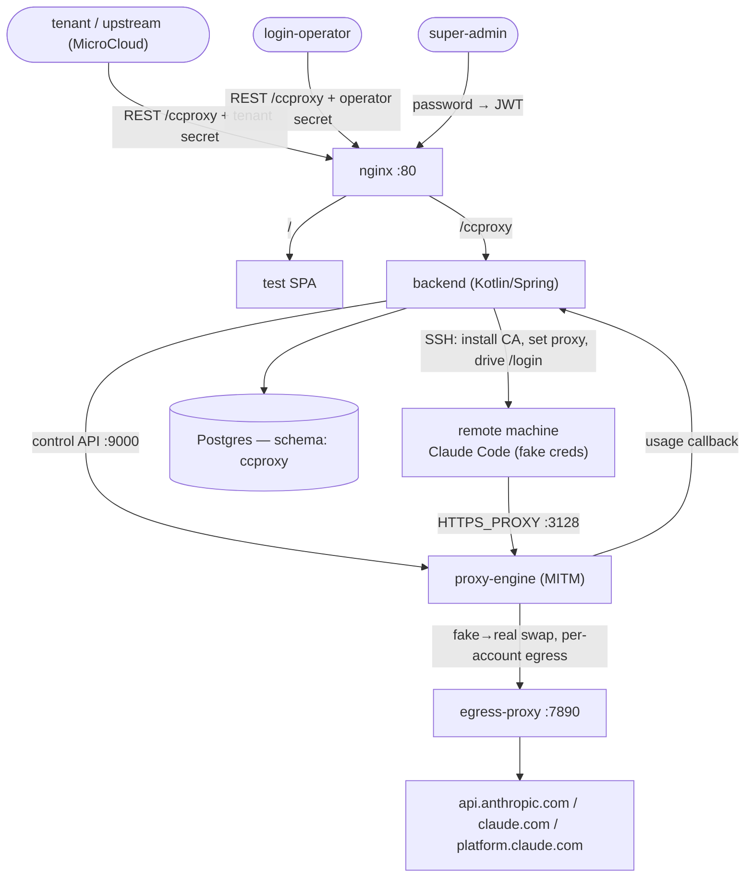

# CCProxy

CCProxy lets a remote machine run an ordinary, interactive **Claude Code** on a normal Anthropic
plan while the **real OAuth credentials never live on that machine**. A man-in-the-middle proxy (the
*proxy-engine*) sits between the machine's Claude Code and Anthropic and swaps a per-machine **fake**
credential for the machine's own **real** credential on the wire. The machine can talk to Claude
normally, but it never holds a token it could exfiltrate, and every machine is metered independently.

> **The hard rule:** one machine = one independent Claude Code login, exactly like a person using
> Claude Code on their own computer. Real tokens are per-machine and are never shared across
> machines. Claude Code always runs in normal interactive mode — never `claude -p` / `--console`
> as the *login* path (those can draw on different quota); `claude -p` is used only to smoke-test a
> machine after it is READY.

This repository is a working proof of concept. It has been validated end to end: a plain Debian
container was provisioned, a human completed the OAuth step in a browser, the engine swapped the
tokens, and `claude` on the machine returned a real model response through the proxy.

---

## Table of contents

- [Concept](#concept)
- [Roles](#roles)
- [End-to-end lifecycle](#end-to-end-lifecycle)
- [Architecture](#architecture)
- [Components](#components)
- [Deployment](#deployment)
- [A full walkthrough with curl](#a-full-walkthrough-with-curl)
- [What a machine must provide](#what-a-machine-must-provide)
- [Operational notes & gotchas](#operational-notes--gotchas)
- [Build & CI](#build--ci)
- [Security model](#security-model)
- [Repository layout](#repository-layout)
- [Provenance](#provenance)

---

## Concept

Claude Code authenticates with an OAuth flow that yields per-user tokens. If you hand those tokens
to a fleet of machines you lose per-machine metering and any machine can walk off with the
credential. CCProxy keeps the credential off the machine:

1. Each machine is pointed at the proxy-engine via `HTTPS_PROXY` and trusts a CCProxy-owned CA.
2. When a machine logs in, the engine intercepts the OAuth **code exchange**: Claude Code on the
   machine only ever sees a **fake** authorization code and **fake** tokens minted by the engine.
3. The engine holds the mapping fake ⟷ real and rewrites it on every request the machine makes to
   Anthropic, so from Anthropic's side the traffic is a normal, authenticated session, and from the
   machine's side the real token never appears.
4. All of a machine's traffic (and the browser login) egresses through one **account egress proxy**
   so the login and the subsequent API calls share a single outbound IP.

---

## Roles

| Role | Auth | Responsibilities |
|---|---|---|
| **super-admin** | password → session JWT | manages tenants, login-operators, and the Anthropic **account pool**; sees every machine and all usage. The account pool is invisible to everyone else. |
| **tenant** (e.g. MicroCloud) | opaque bearer secret | registers its own **machines**, triggers their logins, and reads its own usage. Never sees the account pool or other tenants. |
| **login-operator** | opaque bearer secret | the human who performs the manual OAuth step: works the **login-request** queue, opens the authorize URL in a browser, and submits the returned code. |

Secrets are opaque bearer tokens minted by the super-admin (`POST /tenant/{id}/secret`,
`POST /login-operator/{id}/secret`) and are validated by a filter (`SecretAuthFilter`) that maps a
secret to its principal. The super-admin authenticates with a password (`POST /superadmin/login`)
and receives a JWT.

---

## End-to-end lifecycle

```
super-admin: create account(s) in the pool ── each carries an egress proxy URL
super-admin: create a tenant + mint a tenant secret
super-admin: create a login-operator + mint an operator secret

tenant:      POST /machine            ── binds the machine to a free account, status=CREATED
             (async) provision        ── SSH in: install CA, set HTTPS_PROXY + NODE_EXTRA_CA_CERTS,
                                          register the session with the engine → status=AWAITING_LOGIN
tenant:      POST /machine/{id}/login ── opens a login-request, status=LOGGING_IN
             (async) prepare          ── tmux runs Claude Code, drives the first-run wizard, scrapes
                                          the OAuth authorize URL → login-request AWAITING_CODE

operator:    GET  /login-request      ── sees the pending request + the authorize URL
             (browser) open the URL, authenticate as the account identity, copy the "code#state"
operator:    POST /login-request/{id}/code
             (async) apply            ── prime the engine (real code → fake code), paste the fake
                                          code into Claude Code; the engine intercepts the token
                                          exchange, gets REAL tokens from Anthropic, hands FAKE
                                          tokens to the machine → machine status=READY

machine:     runs Claude Code normally; the engine rewrites fake→real on every Anthropic request.
             usage is reported back to the backend and attributed to the machine/tenant.
```

Machine status flow: `CREATED → PROVISIONING → AWAITING_LOGIN → LOGGING_IN → READY` (or `ERROR`).
Login-request status flow: `PREPARING → AWAITING_CODE → APPLYING → COMPLETED` (or `FAILED`).

---

## Architecture



---

## Components

| Component | Tech | Role |
|---|---|---|
| **backend** | Kotlin / Spring Boot 3.4 | The control plane. Implements the API generated from `CCProxy-API.yml`, the three-role authz, the account pool, machine provisioning over SSH, and login orchestration. |
| **proxy-engine** | Python (stdlib only) | The data plane. A forward proxy on `:3128` that MITMs Anthropic hosts per session, plus a control API on `:9000` the backend uses to register sessions and prime/read logins. Signs per-host leaf certs from the mounted CA. |
| **egress-proxy** | Python (stdlib only) | The default per-account egress. A plain `CONNECT` proxy on `:7890` so a machine's API traffic and its browser login share one outbound IP. An account may instead point at any external proxy. |
| **frontend** | React + Vite | A minimal test SPA that talks only to the public `/ccproxy` API. Useful for driving the flow by hand. |
| **nginx** | — | Gateway on `:80`: `/` → SPA, `/ccproxy` → backend. |
| **postgres** | — | State, in the `ccproxy` schema. |

### proxy-engine control API (used by the backend, secret-guarded)

- register a session: `proxyUser`, `proxyPassword`, and the account egress proxy.
- prime the next token exchange for a session with `realCode → fakeCode` (+ state).
- read whether a session has captured a credential yet (and when it expires).
- usage the backend polls and attributes to machines.

The engine keys everything by **`proxyUser`** (a stable `m{machineId}` handle). Sessions live **in
memory** — restarting the engine drops them, so a machine must be re-provisioned (which re-registers
its session) after an engine restart.

---

## Deployment

The deployable artifact is a **bundle** produced by CI (`ccproxy-deploy`) or assembled from
`deploy/`. It contains `docker-compose.yml`, `nginx.conf`, `gen-env.sh`, `CREATE.sql`, `init/`,
`backend/backend.jar`, `frontend/dist/`, and `proxy-engine/`.

```sh
cd ccproxy-deploy        # the unpacked bundle (or the repo's deploy/ dir)
bash gen-env.sh          # one-time: generates .env, keys/, and app_data/
docker compose up -d --wait
```

`gen-env.sh` generates, if absent:

- `.env` — `SUPERADMIN_PASSWORD`, `ENGINE_SECRET`, the published `NGINX_HTTP_PORT` (default 80), and
  `ENGINE_PROXY_ENDPOINT` / `ENGINE_PROXY_PORT` (see below).
- `keys/ca.crt` + `keys/ca.key` — the MITM CA the engine signs leaf certs with and machines trust.
- `keys/operator` + `keys/operator.pub` — the SSH keypair the backend uses to reach machines.
- `app_data/` — Postgres data.

**`keys/` is mounted read-only** into the backend and engine. The gateway listens on
`http://localhost:${NGINX_HTTP_PORT}`; the API is under `/ccproxy`, the SPA at `/`.

Read the super-admin password with `grep SUPERADMIN_PASSWORD .env`.

### The engine must be reachable from your machines

Each machine is handed `HTTPS_PROXY=http://m{id}:…@${ENGINE_PROXY_ENDPOINT}`. The default
`proxy-engine:3128` is a **docker-internal hostname that only resolves for machines on this compose
network** (e.g. sibling containers). For any machine **outside** the compose network — the normal
case — set `ENGINE_PROXY_ENDPOINT` in `.env` to a `host:port` that machine can actually reach (this
host's LAN or public address), and keep `ENGINE_PROXY_PORT` published there. The port is
auth-protected (per-machine proxy credentials), not an open proxy. If a machine's Claude Code exits
immediately at login with a connectivity error, the proxy endpoint is almost certainly unreachable
from it.

---

## A full walkthrough with curl

```sh
B=http://localhost:80/ccproxy

# 1. super-admin logs in
TOK=$(curl -s -X POST $B/superadmin/login -H 'Content-Type: application/json' \
      -d "{\"password\":\"$(grep SUPERADMIN_PASSWORD .env | cut -d= -f2)\"}" | jq -r .token)
A="Authorization: Bearer $TOK"

# 2. add an account to the pool (proxy defaults to the bundled egress-proxy)
curl -s -X POST $B/account   -H "$A" -H 'Content-Type: application/json' \
      -d '{"email":"you@example.com","remark":"pool #1"}'

# 3. create a tenant + secret, and a login-operator + secret
TID=$(curl  -s -X POST $B/tenant -H "$A" -H 'Content-Type: application/json' -d '{"name":"t1"}' | jq -r .id)
TSEC=$(curl -s -X POST $B/tenant/$TID/secret -H "$A" -H 'Content-Type: application/json' -d '{}' | jq -r .secret)
OID=$(curl  -s -X POST $B/login-operator -H "$A" -H 'Content-Type: application/json' -d '{"name":"op1"}' | jq -r .id)
OSEC=$(curl -s -X POST $B/login-operator/$OID/secret -H "$A" -H 'Content-Type: application/json' -d '{}' | jq -r .secret)

# 4. the tenant learns the operator SSH public key to authorize on its machines
curl -s $B/provisioning/ssh-pubkey -H "Authorization: Bearer $TSEC"

# 5. the tenant registers a machine (host must be reachable from the backend over SSH)
MID=$(curl -s -X POST $B/machine -H "Authorization: Bearer $TSEC" -H 'Content-Type: application/json' \
      -d '{"host":"my-host","label":"m1"}' | jq -r .id)
#    poll until AWAITING_LOGIN:
curl -s $B/machine/$MID -H "Authorization: Bearer $TSEC" | jq .status

# 6. the tenant triggers login; poll the login-request (as the operator) for the authorize URL
LRID=$(curl -s -X POST $B/machine/$MID/login -H "Authorization: Bearer $TSEC" | jq -r .id)
curl -s $B/login-request/$LRID -H "Authorization: Bearer $OSEC" | jq '{status, oauthUrl}'

# 7. open oauthUrl in a browser, authenticate, copy the "code#state", then submit it
curl -s -X POST $B/login-request/$LRID/code -H "Authorization: Bearer $OSEC" \
      -H 'Content-Type: application/json' -d '{"codeState":"<code>#<state>"}'

# 8. poll until the machine is READY
curl -s $B/machine/$MID -H "Authorization: Bearer $TSEC" | jq '{status, hasCredential}'
```

The same flow can be driven from the test SPA at `/`.

---

## What a machine must provide

CCProxy drives the machine over SSH; it does **not** install any of the machine's own tooling. You
must prepare each machine yourself before `POST /machine`. A machine must have, all of it:

**Access**

- **SSH reachable** from the backend at `host:sshPort` (default port `22`).
- A login user (`sshUser`, default `root`). If it is **not** `root`, that user must have
  **passwordless `sudo`** — provisioning runs its install script as `sudo bash` for non-root users
  (for `root` it runs plain `bash`, no sudo).
- The **operator SSH public key** (`GET /provisioning/ssh-pubkey`) present in that user's
  `~/.ssh/authorized_keys`.

**Software on `PATH`** (a bare OS image has none of these — install them):

| Needed | Why | How to install |
|---|---|---|
| `claude` | the Claude Code CLI that is logged in and run | `curl -fsSL https://claude.ai/install.sh \| bash` (self-contained — bundles its own runtime, no separate Node.js needed) |
| `tmux` | login runs Claude Code inside a tmux session | `apt-get install -y tmux` |
| `update-ca-certificates` | installs the MITM CA into the trust store | `apt-get install -y ca-certificates` |
| `bash`, `base64` | the provisioning script base64-decodes the CA onto disk | usually already present (`bash`, `coreutils`) |

Concrete setup for a fresh Debian/Ubuntu machine (run as the SSH user, with sudo if not root):

```sh
apt-get update && apt-get install -y tmux ca-certificates curl
curl -fsSL https://claude.ai/install.sh | bash          # Claude Code (self-contained)
# then add the operator public key so CCProxy can SSH in:
mkdir -p ~/.ssh && curl -s "$BACKEND/ccproxy/provisioning/ssh-pubkey" -H "Authorization: Bearer $TENANT_SECRET" \
  | sed -n 's/.*"publicKey":"\([^"]*\)".*/\1/p' >> ~/.ssh/authorized_keys
```

> **Important — provisioning does NOT verify this.** `provision()` only installs the CA, sets the
> proxy, and registers the session, so a machine with **no `claude` or `tmux`** still reaches
> `AWAITING_LOGIN`. The missing tool is only discovered when you trigger **login**, which then fails
> (e.g. `tmux: command not found`) and bounces the machine back to `AWAITING_LOGIN`. If a login flips
> straight back to `AWAITING_LOGIN`, read the login-request's `error` — it is almost always a missing
> package or a `sudo`/permission problem on the machine.

Provisioning then, over SSH:

1. writes the CA to `/usr/local/share/ca-certificates/ccproxy-ca.crt` and runs
   `update-ca-certificates`;
2. appends to `/etc/environment`: `HTTPS_PROXY`/`HTTP_PROXY` (this machine's own proxy-auth against
   the engine) and `NODE_EXTRA_CA_CERTS` pointing at the CA;
3. registers the session with the engine.

Login then runs Claude Code inside `tmux` with those env vars set explicitly on the session.

---

## Operational notes & gotchas

These are real behaviours discovered while validating the flow — worth knowing before touching it:

- **Node ignores the system CA store.** Installing the CA with `update-ca-certificates` is not
  enough for Claude Code; you must also set `NODE_EXTRA_CA_CERTS` to the CA file, or Node fails with
  `UNABLE_TO_VERIFY_LEAF_SIGNATURE`.
- **The engine's `keys/` is read-only**, so the per-host leaf-cert serial file is written into the
  engine's writable certs dir (`CCPROXY_CERTS_DIR`), not next to the CA.
- **The CA is shipped to machines base64-encoded on one line**, not via a heredoc — a multi-line PEM
  inside an indented heredoc gets mangled and the installed CA won't match the engine's signing CA.
- **Claude Code exits if its terminal is too small**, so the login `tmux` pane is created wide
  (`-x 1000`); a wide pane also keeps the long OAuth URL on a single, un-wrapped line so it can be
  scraped whole.
- **The first-run wizard is: theme → login method → authorize URL.** The orchestrator sends two
  Enters (accept theme, pick "Claude account with subscription"); it does not type `/login`.
- **Bracketed paste swallows a trailing Enter**, so the code and the Enter are sent as two separate
  `tmux send-keys` calls.
- **The authorize URL is on `claude.com`** (redirecting to `platform.claude.com`); the scraper
  matches any `https://…oauth…` URL rather than a fixed host.
- **Claude Code is launched via a login shell** (`bash -lc claude`) so the machine user's profile
  `PATH` is loaded — the `claude.ai` installer puts `claude` in `~/.local/bin`, which is not on a
  non-interactive SSH `PATH`, so a bare `claude` would exit and kill the tmux session.
- **The engine must be reachable from the machine.** Machines outside the compose network need
  `ENGINE_PROXY_ENDPOINT` set to a routable `host:port` (see Deployment); the docker-internal
  `proxy-engine:3128` default only works for in-network machines.
- **Engine sessions are in memory.** After an engine restart, re-provision machines to re-register
  their sessions.
- **Optional traffic dump.** With `CCPROXY_DUMP_DIR` set (the bundle points it at
  `app_data/dumps/`, on by default; set `ENGINE_DUMP_DIR=` in `.env` to turn it off), the engine
  mirrors every decrypted request/response to `app_data/dumps/<machine>/*.http`. It records the
  machine's view (fake credential — real tokens are never written to disk) and runs in a daemon
  thread, so it never affects the bytes forwarded to the client. It can grow large — prune it.
- **The engine currently buffers whole responses** before returning them (it reads the full body to
  swap tokens and recompute Content-Length), so a streaming response reaches the client in one shot
  rather than incrementally. Fine for correctness and short calls; making it a true chunk-by-chunk
  passthrough for non-token endpoints would be a separate change.
- **`CREATE.sql` is generated at build time** (from entity metadata) and is not versioned; CI ships
  it into the bundle as an artifact.

---

## Build & CI

Local backend build (needs Docker for the test Postgres):

```sh
cd backend
./scripts/dependency-start.sh   # local Postgres with the "ccproxy" schema
./mvnw install                  # generates the API from the spec, builds, runs tests, applies spotless
```

Frontend:

```sh
cd frontend && npm ci && npm run build
```

CI (`.github/workflows/build.yml`) builds the backend (`mvnw install`, which also enforces spotless
formatting and regenerates the API), builds the frontend, lints the shell scripts and the
stdlib-only `proxy-engine`, packages the deployment bundle, and then **proves the bundle boots** by
bringing the whole docker-compose cluster up and waiting for every service to be healthy.

**Toolchain note:** the backend is pinned to **Kotlin 2.1.10** via the **Spring Boot 3.4** line, and
`io.ktor` is held at a Kotlin-2.1-compatible version. Bumping either Spring Boot to 4.x or ktor to
3.5+ pulls artifacts compiled against Kotlin 2.3 and requires a deliberate Kotlin upgrade first;
those two are marked `ignore` in `dependabot.yml`.

---

## Security model

- **No real token ever reaches a machine.** Claude Code on the machine only holds engine-minted fake
  tokens; the engine rewrites fake→real on the wire.
- **Per-machine isolation.** Every machine has its own proxy credentials (`m{id}`), its own session,
  and its own login. One machine cannot use another's credential.
- **Tenants cannot see the account pool.** Which Anthropic identity a machine is bound to, and its
  egress proxy, are visible only to the super-admin.
- **Secrets are opaque bearer tokens** minted by the super-admin and revocable.
- **Trust is scoped:** machines trust only the CCProxy CA for the MITM; the CA private key stays on
  the server (read-only-mounted into backend and engine).

---

## Repository layout

| | |
|---|---|
| **`CCProxy-API.yml`** | the single API contract; the backend's `app.microteams.ccproxy.api.*Api` and the frontend client are generated from it |
| **`backend/`** | Kotlin / Spring Boot. The borrowed authz framework keeps its `org.rucca.cheese.auth` package; everything else is `app.microteams.ccproxy` |
| **`proxy-engine/`** | the MITM data plane (`ccproxy_engine.py`) + the default egress proxy (`egress.py`), stdlib Python |
| **`frontend/`** | React + Vite test SPA (calls only the public `/ccproxy` API) |
| **`deploy/`** | the docker-compose bundle (nginx + backend + proxy-engine + egress-proxy + postgres) and `gen-env.sh` |

---

## Provenance

Derived from [`micro-cloud`](https://github.com/micro-teams/micro-cloud): same stack, CI structure,
and bundle-deploy pattern, with the Proxmox / provisioning / newapi domain removed and the MITM
engine added.
