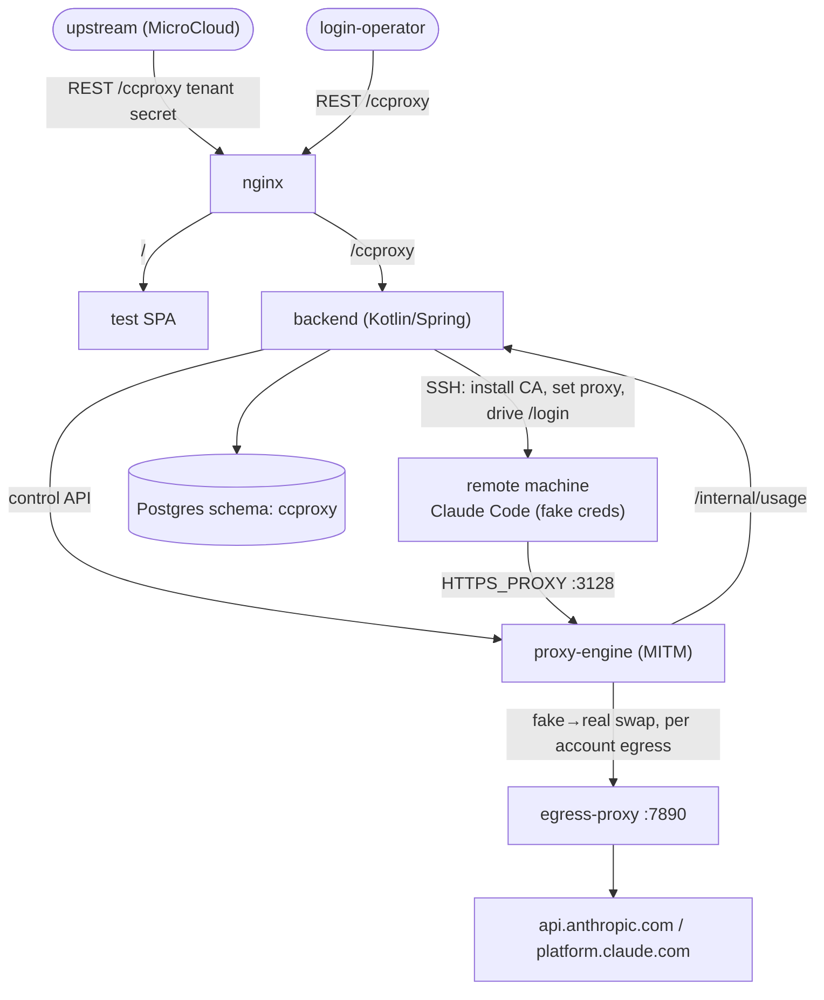

# CCProxy

CCProxy lets a remote machine run an ordinary, interactive **Claude Code** on a normal Anthropic
plan while the **real OAuth credentials never live on that machine**. A MITM proxy (the
*proxy-engine*) sits between the machine's Claude Code and Anthropic and swaps a per-machine **fake**
credential for the machine's own **real** credential on the wire, so the machine can't be used to
steal credentials and bypass metering.

> **The hard rule:** one machine = one independent Claude Code login, exactly like a person using
> Claude Code on their own computer. Real tokens are per-machine, never shared across machines.
> Claude Code always runs in normal interactive mode — never `claude -p` / `--console` (different
> quota).

## Roles

| Role | Auth | Does |
|---|---|---|
| **super-admin** | password → session JWT | manages tenants, login-operators, the Anthropic **account pool**; sees all machines/usage |
| **tenant** (e.g. MicroCloud) | opaque secret | registers its **machines**, triggers logins, reads its usage — never sees the account pool |
| **login-operator** | opaque secret | performs the manual OAuth step from the **login-request** queue |

## Architecture



## Layout

| | |
|---|---|
| **`CCProxy-API.yml`** | the single API contract; the backend's `app.microteams.ccproxy.api.*Api` and the frontend client are generated from it |
| **`backend/`** | Kotlin / Spring Boot. Borrowed authz framework keeps its `org.rucca.cheese.auth` package; everything else is `app.microteams.ccproxy` |
| **`proxy-engine/`** | the MITM data plane + the default egress proxy (stdlib Python) |
| **`frontend/`** | minimal React + Vite test SPA (calls only the public `/ccproxy` API) |
| **`deploy/`** | docker-compose bundle (nginx + backend + proxy-engine + egress-proxy + postgres) |

## Build & run

```sh
cd backend && ./scripts/dependency-start.sh   # local Postgres with the "ccproxy" schema
./mvnw install                                 # builds + runs integration tests
```

The whole cluster: `cd deploy && bash gen-env.sh && docker compose up -d`.

Derived from [`micro-cloud`](https://github.com/micro-teams/micro-cloud): same stack, CI, and
bundle-deploy pattern, with the Proxmox/provisioning/newapi domain removed and the MITM engine added.
